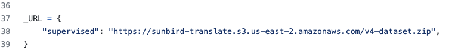

# Language parallel text exploratory data analysis and data preparation
Exploratory data analysis and data preparation scripts for model training, done on the `ug-language-parallel-text` dataset  

### Steps for creation of the model training dataset files from the publicly available json dataset
- Concatenate any new chunks of data into the publicly available [json dataset](https://github.com/SunbirdAI/ug-language-parallel-text-dataset) by running the `Data EDA and cleaning.ipynb` notebook
- Create the model training dataset files and put them in the right folder structure by running the `Model Training Data Prep.ipynb` and `Multilingual Data Prep.ipynb` notebooks, in that order
- Upload the dataset to the `sunbird-translate` bucket on `AWS S3` (as a versioned dataset, for example `v4-dataset.zip`) and make sure the resource is public
- Update the dataset URL in the [SunbirdAI/datasets](https://github.com/SunbirdAI/datasets/blob/init-sunbird-dataset/datasets/sunbird/sunbird.py) repository with the new dataset link (as shown in the next section of this `README`)
- Run the `SunbirdAI` language model training notebooks on `AWS SageMaker`
- Save the checkpoints and upload them to the `sunbird-translate` `AWS S3` bucket, in the `models` folder
- Upload the models to [Hugging Face](https://huggingface.co/Sunbird)

### How to add the dataset link in `SunbirdAI/datasets`
Find the `_URL` constant in the `datasets/sunbird/sunbird.py` file on the `init-sunbird-dataset` branch of the [SunbirdAI/datasets](https://github.com/SunbirdAI/datasets/blob/init-sunbird-dataset/datasets/sunbird/sunbird.py) repository. 
The image below shows an example of this:

